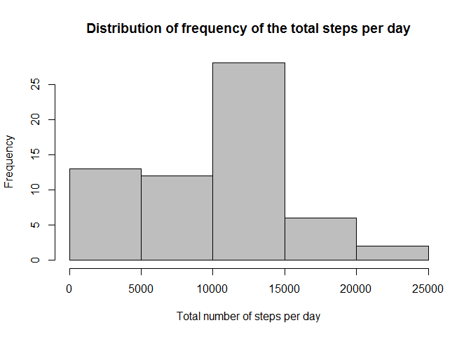

# Reproducible Research: Peer Assessment 1
    
       
          

## 1. Loading and preprocessing the data


```r
knitr::knit_hooks$set(inline = as.character)
setwd("D:/R/R-travail/MOOC R programming march2015/5-Reproducible research/RepData_PeerAssessment1/RepData_PeerAssessment1")
d <- read.csv("activity.csv")
d$date <- as.Date(d$date, format="%Y-%m-%d")
d$interval <- as.factor(d$interval)
d$steps <- as.numeric(d$steps)
str(d)
```

```
## 'data.frame':	17568 obs. of  3 variables:
##  $ steps   : num  NA NA NA NA NA NA NA NA NA NA ...
##  $ date    : Date, format: "2012-10-01" "2012-10-01" ...
##  $ interval: Factor w/ 288 levels "0","5","10","15",..: 1 2 3 4 5 6 7 8 9 10 ...
```

## 2. What is the mean total number of steps taken per day?

### Total number of steps per day
Here I calculate the total number of steps per day and do a histogram of them

```r
sumstep <- tapply(d$steps, d$date,sum, na.rm=TRUE)
hist(sumstep, xlab="Total number of steps per day", main="Distribution of frequency of the total steps per day", col="grey", breaks=6)
```

 

We can see that the highest frequency corresponds to a total number of steps of 10000-15000 per day.

### Mean and median of the total number of steps per day

```r
meanstep <- mean(sumstep, na.rm=TRUE); meanstep
```

```
FALSE [1] 9354.23
```

```r
medianstep <- median(sumstep, na.rm=TRUE); medianstep
```

```
FALSE [1] 10395
```

So the mean is equal to 9354 and the median to 10395.

## 3. What is the average daily activity pattern?

### Time series plot of the 5-minute interval of step activity averaged across all days:

```r
meanstepinterval <- tapply(d$steps, d$interval, mean, na.rm=TRUE)
xaxis <- seq(1/12,24,1/12)
plot(y=meanstepinterval, x=round(xaxis,1), type="l", main="Average daily activity pattern", xlab="Time (hours)", ylab="Mean number of steps", col="blue")
```

 

We can see step activity from 6am to midnigth, with a pic at 8-9am.

### Which 5-minute interval contains the maximum number of steps?


```r
sub<-cbind(xaxis,meanstepinterval)
value<-sub[meanstepinterval==max(meanstepinterval),]; value
```

```
FALSE            xaxis meanstepinterval 
FALSE         8.666667       206.169811
```

The interval containing the maximum number of steps is 8.6-8.7 hours or 515-520 minutes

## 4. Imputing missing values
    
### Total number of missing values in the dataset

```r
good <- complete.cases(d)
a<-nrow(d)-nrow(d[good,]); a
```

```
## [1] 2304
```

So there are 2304 lines with missing values.

### Creation of a new data set filling the missing values with the mean for that 5-minute interval

I replace each NA by the mean value for that 5-minute interval, by a for loop.

```r
dfull <- d
for(i in levels(dfull$interval)){
     dfull[which(dfull$interval==i),]$steps[is.na(dfull[which(dfull$interval==i),]$steps)] <- mean(dfull[which(dfull$interval==i),]$steps, na.rm=TRUE)
}

# to verify there is no more NA
sum(is.na(dfull$steps))
```

```
## [1] 0
```

```r
head(dfull)
```

```
##       steps       date interval
## 1 1.7169811 2012-10-01        0
## 2 0.3396226 2012-10-01        5
## 3 0.1320755 2012-10-01       10
## 4 0.1509434 2012-10-01       15
## 5 0.0754717 2012-10-01       20
## 6 2.0943396 2012-10-01       25
```

### Histogram of the total number of steps taken each day from this full data set:


```r
sumstep2 <- tapply(dfull$steps, dfull$date,sum, na.rm=TRUE)
hist(sumstep2, xlab="Total number of steps per day", main="Distribution of frequency of the total steps per day (full dataset)", col="grey", breaks=6)
```

 

### Calculation of the mean and median of the total number of stps taken per day


```r
meanstep2 <- mean(sumstep2, na.rm=TRUE); meanstep2
```

```
FALSE [1] 10766.19
```

```r
medianstep2 <- median(sumstep2, na.rm=TRUE); medianstep2
```

```
FALSE [1] 10766.19
```

So the mean is equal with a full data set wihout NA to 10766 and the median to 10766 (previously with NA: 9354 and 10395 respectively). So the values increased a little bit. Imputing missing values clarifies the data, they are nicer. 


## 5. Are there differences in activity patterns between weekdays and weekends?

Firstly, I add to the full dataset a new variable (day) in order to know the day. Then I add the variable "cat" which give me the information weekday / weekend.


```r
dfull$day <- weekdays(dfull$date)
dfull$cat <- ifelse(dfull$day == "samedi", "weekend", ifelse(dfull$day == "dimanche", "weekend", "weekday"))
```

Secondly, I calculate the mean step per day in both categories weekday/weekend and then I put the data in one dataframe called "dataplotfinal".


```r
# for weekend
subend <- subset(dfull, dfull$cat=="weekend")
meanstepintervalend <- tapply(subend$steps, subend$interval, mean, na.rm=TRUE)
meanstepintervalend <- as.vector(meanstepintervalend)
dataplotend <- as.data.frame(meanstepintervalend)
dataplotend$weekday <- "weekend"
dataplotend$interval <- levels(dfull$interval)
names(dataplotend) <- c("meanstepinterval", "day", "interval")

# for weekday
subday <- subset(dfull, dfull$cat=="weekday")
meanstepintervalday <- tapply(subday$steps, subday$interval, mean, na.rm=TRUE)
meanstepintervalday <- as.vector(meanstepintervalday)
dataplotday <- as.data.frame(meanstepintervalday)
dataplotday$weekday <- "weekday"
dataplotday$interval <- levels(dfull$interval)
names(dataplotday) <- c("meanstepinterval", "day", "interval")

# final data
dataplotfinal <- rbind(dataplotend, dataplotday)
str(dataplotfinal)
```

```
FALSE 'data.frame':	576 obs. of  3 variables:
FALSE  $ meanstepinterval: num  0.21462 0.04245 0.01651 0.01887 0.00943 ...
FALSE  $ day             : chr  "weekend" "weekend" "weekend" "weekend" ...
FALSE  $ interval        : chr  "0" "5" "10" "15" ...
```

```r
dataplotfinal$day <- as.factor(dataplotfinal$day)
dataplotfinal$interval <- as.numeric(dataplotfinal$interval)
head(dataplotfinal)
```

```
FALSE   meanstepinterval     day interval
FALSE 1      0.214622642 weekend        0
FALSE 2      0.042452830 weekend        5
FALSE 3      0.016509434 weekend       10
FALSE 4      0.018867925 weekend       15
FALSE 5      0.009433962 weekend       20
FALSE 6      3.511792453 weekend       25
```

Finally here is the panelplot to compare the daily step activity per day between the weekdays and the weekend. It was generated by lattice.


```r
library(lattice)
xyplot(meanstepinterval ~ interval | day, data=dataplotfinal, type="l", layout=c(1,2), xlab="Interval", ylab="Number of steps")
```

 

We can see that the activity during the weekend is higher than during the weekday. 


